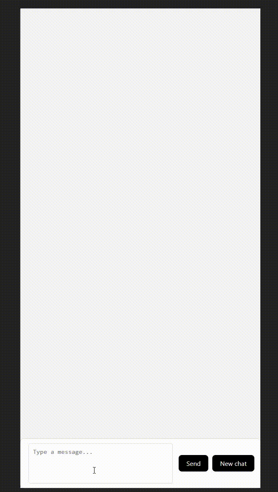

# Detection maladie


# Back
* ```python -m venv venv```
* ```source venv/Scripts/activate```
* ```pip install requirements.txt```
* ```deactivate```

# Front
* ```npm install```
* ```npm run dev```

# Update Python file when installing news libs
* ```sh update.sh```